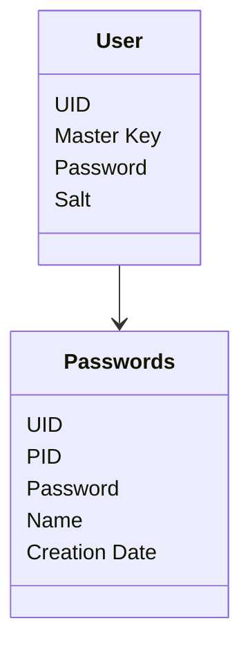

# The database plan

## Tables

### User

- (PK) UID
- Encrypted Master Key
- Hashed Password
- Username

### Passwords

- (FK, PK) UID
- (PK) PID
- Encrypted Password
- Website / App name 
- Creation date
- Site username

